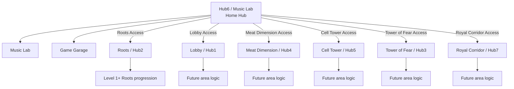
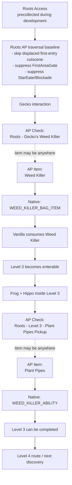
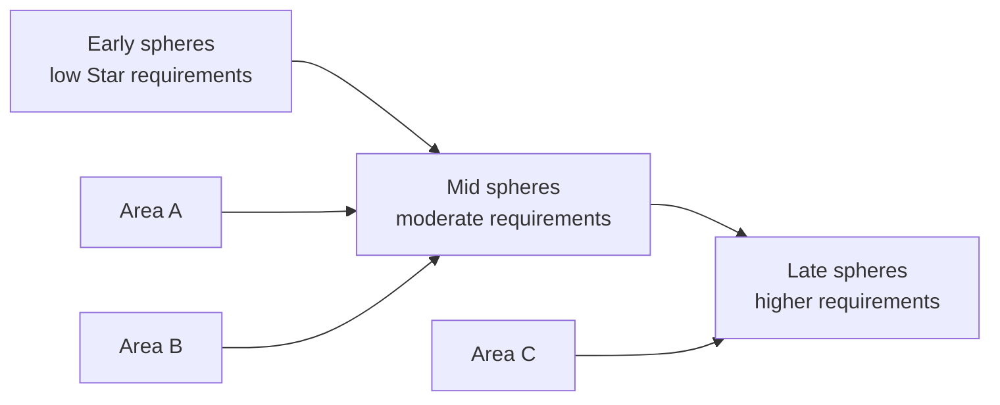
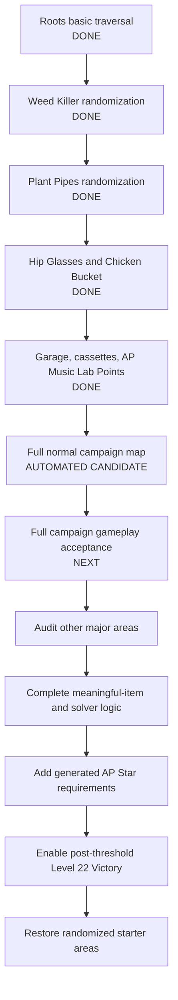

> Current published scope: **v0.28.0 / Client v0.75.0 — First Completable Release**. See the [release notes](https://github.com/Akamarus/Super-Crazy-Rhythm-Castle-Archipelago/blob/v0.28.0/docs/releases/v0.28.0.md) and [known issues](https://github.com/Akamarus/Super-Crazy-Rhythm-Castle-Archipelago/blob/v0.28.0/docs/KNOWN_ISSUES.md). Native AP Star/victory acceptance remains pending; older candidate and deployment statements below record historical checkpoints.

# AP Stars combined candidate — native playthrough acceptance pending

**Client v0.75.0 / APWorld v0.28.0** uses schema 19 / campaign-mapping schema 1.
Use a fresh v0.28 seed and fresh native save for candidate testing. This implementation
has not been deployed; installed client v0.74.2 and the running test seed remain unchanged.
The published v0.26.0-dev release is a separate historical baseline.

Active totals: Normal 164 / Hard 222 / Expert 280 / Perfection 316.
All 66 AP Stars are active, with generated campaign gates and a Level 22 clear after
reaching the configured goal (1–66, default 50). An early boss clear followed by later
Star receipt does not win; another clear is required. Native result stars still report
performance checks and are never overwritten by AP Stars.

The 39 supplemental sources include Cell Tower Star Eater Fed and King Ferdinand
Unlocked. The six Bee/Devil completions remain separate binary checks. The user
confirmed 33 of the prior 37 checks; three Devil runs and the Certificate were skipped
and remain unverified. No replay of those skipped tests is required in this pass.

Normal has 152 modeled non-filler slots for 137 non-filler items (135 progression plus
two useful characters), not merely 164 raw checks. Existing item quantities and the
180-point Music Lab economy are unchanged. Native prerequisite closures are conservative
candidate rules; full native playthrough validation remains pending. The final world
passed a 48-case actual generation/playthrough matrix across four difficulties and
goals 1/25/50/66. A prior near-goal gate curve failed; the corrected curve caps entry
gates at half the goal while Victory still requires the full goal.

Detailed rules: `apworld/scrc/docs/ap-stars-logic.md`. Native acceptance, deployment
and release are separate steps. The older version/status sections below are historical
and do not override this candidate checkpoint.

---

# Project Overview and Randomizer Design

This document is the living technical/design overview for the **Super Crazy Rhythm Castle Archipelago** project. It is intended to let players, testers, contributors, and future developers understand what the randomizer currently does, why it is structured this way, and what is planned next.

> **Status:** Work in progress. The implementation is being developed incrementally, with gameplay testing used to confirm native progression flags and source behavior before those systems are committed to Archipelago logic.

Installed **v0.73.11** repairs the unopened20-point chest being blocked by AP Meoo ownership; build, focused regressions and same-save gameplay retest passed. Chest sent one Stardust check and did not restore consumed Car Battery.

Installed repair: **Client v0.73.10**. Meoo hand-in suppression, separate AP character receipt, Plunger early use/source pickup, Roots feed check, and full-process restart persistence are gameplay confirmed for the focused test seed. Remaining character order and offline/isolation cases are listed in the acceptance record. Fresh schema-17 testing found that the battery hand-in unlocks Meoo without its AP item; the native sequence-step repair and regression evidence are in the quest acceptance record. The published prerelease retains this known issue until a gameplay-verified follow-up.

Current experimental release: **Client v0.73.9 / APWorld v0.26.0**, slot-data schema 17,
campaign-mapping schema 1, and quest checks schema 1. Installed client **v0.73.9**
is gameplay accepted for Garage cartridge insertion, native placement, medal previews,
and restart persistence on the retained schema-16 seed. The v0.73.9 cleanup removes
superseded Garage helpers and temporary diagnostics; it is installed and gameplay accepted.
A fresh v0.26 seed and fresh native save are required to accept the new quest features.
Existing schema-16 seeds keep their earlier behavior and do not gain new quest checks.

Current addressed totals: **Normal 125 / Hard 183 / Expert 241 / Perfection 277**.
The new useful AP rewards are Plunger, Meoo, and Maniac. Old Game Data and Car
Battery are progression inputs to their new hand-in checks. Original Music Lab
chest IDs and native item mappings are unchanged. Plunger pickup and Roots Star
Eater Fed remain Stardust-only until full native gates are modeled. The native
three-star threshold is retained; it is not an AP Star item requirement.

Garage consumption and native saved-medal previews are gameplay accepted on v0.73.9.
Cleanup verification and separate pending quest acceptance are documented in
[the candidate record](testing/2026-09-16-quest-checks-candidate.md).

## Full normal-campaign mapping milestone (historical v0.24)

Local maintenance candidate (2026-09-14): deferred cassette-save ownership checks
are rate-limited and explicit save callbacks retain their exact owner for existing
pointer validation. Obsolete per-level Access gates and legacy diagnostic polling
are removed; current Area Access and source checks remain. Localhost reconnect
uses explicit WS and exposes bounded underlying prelogin errors. Performance and
in-game reconnect acceptance are still pending; see
[the maintenance record](testing/2026-09-14-client-maintenance.md).

At the v0.24 milestone, all 22 normal campaign identities were mapped. Each has separate `Completion` and `1 Star` checks, plus cumulative `2 Stars` and `3 Stars` checks on the difficulties that enable them. That milestone had addressed-location totals **Normal 121 / Hard 179 / Expert 237 / Perfection 273**; current v0.26 totals are above. Development Caches are retired from new seeds while their permanent IDs remain reserved.

The v0.24/schema-15 client contract retains AP Music Lab Points with the same strict point sub-schema as v0.23/schema 14. Legacy v0.23 seeds retain their partial campaign mapping, including cumulative Level 22 Stars filtered by `active_campaign_star_tiers`. Campaign contract rejection reports the failing field immediately at login. Offline campaign results retain the last validated contract through failed authentication retries; pending checks and local deduplication belong to the authenticated game, seed, team, and slot. A different authenticated identity or shutdown clears that state. Campaign evaluation and queue admission share the identity lock, and a flush rechecks authentication under the current transport lease.

| # | Normal campaign identity | Internal ID |
| ---: | --- | --- |
| 1 | Light Humor | `Level_05` |
| 2 | Pop Party | `Level_06` |
| 3 | The Megafying Ritual | `Level_07` |
| 4 | DJ Eggplant | `Level_08` |
| 5 | Lift Quest | `Level_09` |
| 6 | Boring Room | `Level_02` |
| 7 | Demolition Training | `Level_19` |
| 8 | Minim Tower | `Level_11` |
| 9 | School Trip | `Level_20` |
| 10 | The Vault | `Level_01` |
| 11 | Act 1: Flavor | `Level_12` |
| 12 | Act 2: Sauce and Spice | `Level_15` |
| 13 | Act 3: Montage | `Level_22` |
| 14 | Act 4: Habanero | `Level_23` |
| 15 | Central Mainframe | `Level_16` |
| 16 | The Thief Prince | `Level_24` |
| 17 | Cold Storage | `Level_21` |
| 18 | The Darkness | `Level_03` |
| 19 | Escape | `Level_13` |
| 20 | Loneliness | `Level_25` |
| 21 | Locker Room | `Level_14` |
| 22 | King Ferdinand I | `Level_28` |

Bee and Devil special variants are diagnostic-only: they are read-only observations, do not emit normal campaign checks, and have no active AP locations. **66 AP Stars remain inactive**; generated Star gates and final Victory remain inactive as well. A normal first clear, an improved result, offline/reconnect handling, and the diagnostic logs still need targeted manual acceptance. The broad campaign replay is deferred, so unplayed mappings remain manual-testing pending.

## 1. Project goals

The project integrates **Super Crazy Rhythm Castle** with the Archipelago multiworld randomizer using two cooperating components:

- **Client plugin (`client/`)** — a BepInEx / IL2CPP C# plugin running inside the game. It observes native progression, sends location checks, receives AP items, applies native item/ability state, and normalizes campaign-order blockers that would otherwise make randomized routing impossible.
- **APWorld (`apworld/`)** — defines items, locations, regions, rules, precollected items, and seed generation behavior for Archipelago.

The core design rule is:

```text
Do not replace meaningful game progression with generic unlocks when the real item/story interaction can be preserved.
```

A physical vanilla item source should become an AP **location/check**, while the useful item or ability becomes an AP **item**. When that AP item is received, the client grants the corresponding real native state. Vanilla consumption, trades, and unavoidable story consequences are preserved whenever practical.

---

## 2. High-level randomizer model



### Current starter policy

During the Roots implementation/audit phase, **Roots Access is always precollected** on a new seed. The other five Area Access items are randomized normally.

This is temporary development policy. Once all six areas are proven starter-safe, starter selection can be randomized again.

### Long-term level reachability rule

The intended final rule for a level is:

```text
Area reachable
+ AP Star requirement
+ meaningful randomized item prerequisites
+ unavoidable vanilla story state
```

Randomized Star requirements are intentionally being added **after** the meaningful item/story graph is understood, so Stars do not accidentally bypass important quest progression.

---

## 3. AP item catalog

This table lists the item names currently known to the APWorld. Permanent network IDs are tracked separately in [`IDS.md`](IDS.md).

### Active items

| Item | Classification / purpose | Current behavior |
| --- | --- | --- |
| **Stardust** | Filler | Fills unused item-pool slots. It intentionally has no native progression mapping. |
| **Roots Access** | Progression | Opens the Roots phone route from Hub6. Currently forced precollected. |
| **Lobby Access** | Progression | Opens the Lobby phone route from Hub6. |
| **Meat Dimension Access** | Progression | Opens the Meat Dimension phone route from Hub6. |
| **Cell Tower Access** | Progression | Opens the Cell Tower phone route from Hub6. |
| **Tower of Fear Access** | Progression | Opens the Tower of Fear phone route from Hub6. |
| **Royal Corridor Access** | Progression | Opens the Royal Corridor phone route from Hub6. |
| **Bloody Tears Cartridge** | Progression/useful | Required to use the Bloody Tears song in Game Garage. |
| **Gradius Remix Cartridge** | Progression/useful | Required to use the Gradius Remix song in Game Garage. |
| **Smooch Cartridge** | Progression/useful | Required to use the Smooch song in Game Garage. |
| **Superstar Cartridge** | Progression/useful | Required to use the Superstar song in Game Garage. |
| **Vampire Killer Cartridge** | Compatibility-only | Permanent AP ID retained for old seeds; fresh v0.21 seeds use the physical vanilla pickup and do not generate this AP item. |
| **Wag the Dog Cartridge** | Progression/useful | Required to use the Wag the Dog song in Game Garage. |
| **Weed Killer** | Progression | Native consumable quest item from Gecko. AP delivery grants `WEED_KILLER_BAG_ITEM`; vanilla later consumes it to reveal/access Level 3. |
| **Plant Pipes** | Progression | Permanent usable ability obtained from Frog and Hippo in Level 3. AP delivery grants `WEED_KILLER_ABILITY`. Required to complete Level 3. |
| **30 Music Lab Cassettes** | Progression | v0.22 maps every recognized cassette to one item and one idempotent source. AP delivery grants native `HAVE_IN_BAG`; the player still inserts it in Music Lab normally. |
| **Music Lab Point** | Progression | 10 instances worth 1 each; permanent ID `187256153`. |
| **Music Lab Point Bundle** | Progression | 3 instances worth 10 each; permanent ID `187256154`. |
| **Music Lab Point Large Bundle** | Progression | 7 instances worth 20 each; permanent ID `187256155`. |

### Historical item IDs retained for compatibility

| Item | Status |
| --- | --- |
| **Level 2 Access** | Historical. ID is preserved but this item is no longer generated by the Area Access design. |
| **Level 3 Access** | Historical. ID is preserved but this item is no longer generated by the Area Access design. |

### Planned meaningful items

These names are design targets, not yet committed AP items unless listed above:

| Planned item | Source / role | Status |
| --- | --- | --- |
| **Hip Glasses** | Picked up near the end of Level 4; `LEVEL_08_GLASSES_COLLECTED` is the source and `HIP_GLASSES_BAG_ITEM` is the held item consumed by the Bucket Minion. | Native mapping verified / not implemented. Reload and AP-history reconciliation remain implementation requirements. |
| **Chicken Bucket** | `ROOTS_HUB_BUCKET_MINION_SWAPPED_FOR_GLASSES` is the trade source; `CHICKEN_BUCKET_BAG_ITEM` is later consumed into `COMBO_BUCKET_ABILITY` during Lift Quest. | Native mapping verified / not implemented. The normal trade and use remain player-driven; Combo Bucket is the vanilla consequence. |
| Additional vanilla quest items / abilities | Converted individually when they materially gate traversal or completion. | Future work. |

---

## 4. Roots progression graph

Roots is the first area being fully modeled because it contains several examples of the randomizer's intended philosophy: physical source checks, consumable quest items, permanent abilities, partial-level checks, and campaign-order blockers.



### Gecko / Weed Killer

Vanilla sequence observed and preserved:

```text
ROOTS_HUB_PHONE_BOX_OPENED
→ ROOTS_HUB_GECKO_VANISHED
→ WEED_KILLER_BAG_ITEM = True
→ ROOTS_HUB_WEED_KILLER_COLLECTED = True
```

AP behavior:

- Gecko's native `WEED_KILLER_BAG_ITEM` grant is suppressed.
- `ROOTS_HUB_WEED_KILLER_COLLECTED` is retained as the native source/story marker.
- That marker sends **`Roots - Gecko's Weed Killer`**.
- Receiving **Weed Killer** from AP applies the real `WEED_KILLER_BAG_ITEM` state.
- Vanilla is then allowed to consume the Weed Killer normally to reveal Level 3.

### Frog + Hippo / Plant Pipes

Observed native mapping:

```text
WEED_KILLER_ABILITY = True
LEVEL_07_WK_ABILITY_EARNED = True
```

AP behavior:

- `WEED_KILLER_ABILITY` is suppressed at the vanilla Frog/Hippo source.
- `LEVEL_07_WK_ABILITY_EARNED` remains native and sends **`Roots - Level 3 - Plant Pipes Pickup`**.
- Receiving **Plant Pipes** from AP grants the real `WEED_KILLER_ABILITY`.

### Intentional partial-level progression

Level 3 is deliberately split into **reachability** and **completion**:

```text
Reach Frog/Hippo:
    Roots Access
    + Weed Killer / Level 3 entrance state

Complete Level 3:
    everything above
    + Plant Pipes
```

Therefore a valid seed can require the player to:

1. Enter Level 3.
2. Reach Frog/Hippo and send their AP check.
3. Not have Plant Pipes yet.
4. Exit the level using the normal menu.
5. Continue elsewhere until Plant Pipes arrives.
6. Return and finish Level 3.

The APWorld must never require Plant Pipes to reach its own Frog/Hippo source check.

### First-entry Roots cutscene bypass

The AP start spawns the player in Hub6 rather than following the game's original intro path. When first entering Roots from this displaced route, the normal Roots arrival cutscene can run while the camera/player are elsewhere, which appears as an unexplained movement lock.

Immediately before a permitted first transition into Hub2, the client sets only:

```text
ROOTS_HUB_INTRO_WITNESSED = True
```

This skips that one-time presentation. It does not spoof Gecko, Star Eater, Weed Killer, Level 3, or other Roots quest state.

### Campaign-order traversal normalization

`Roots Access` currently suppresses two physical blockers that exist because vanilla assumes a fixed campaign order:

- `FirstAreaGate`
- `Root/GameRoom_Hub2_Logic/Objects/StarEaterBlockade/Blockade`

These are physical traversal normalizations only. The randomizer does not set the corresponding quest completion flags merely to make the player pass.

---

## 5. Area Access and Hub6 phone routing

Hub6 / Music Lab is the AP home hub. Music Lab and Game Garage remain available regardless of major-area ownership.

The six major Hub6 phones map as follows:

| AP area | Game destination / phone root |
| --- | --- |
| Roots | `GameRoom_Hub2` / `BoxDoor_Roots` |
| Lobby | `GameRoom_Hub1A` / Hub1B / `BoxDoor_Lobby` |
| Meat Dimension | `GameRoom_Hub4` / `BoxDoor_Meat` |
| Cell Tower | Hub5A/B / `BoxDoor_Prison` |
| Tower of Fear | `GameRoom_Hub3` / `BoxDoor_Madness` |
| Royal Corridor | `GameRoom_Hub7` / `BoxDoor_Royal` |

### Locked phone behavior

For an area the player does not own:

- the invisible phone interaction is disabled;
- its transition reactor is disabled;
- known cloth covers remain active;
- the transition request is safety-gated as a final defense.

For an AP-owned area:

- the phone becomes usable;
- its cloth cover is removed where applicable;
- late-game vanilla "visited/open" conditions local to that Hub6 phone can be bypassed without changing the underlying save flag.

This prevents the AP Area Access item from being defeated by campaign-order assumptions in the vanilla phone logic.

---

## 6. Game Garage system

Game Garage currently has **five randomized cartridge items**, the physical vanilla **Vampire Killer** pickup, and **24 sticker checks**.

### Songs

- Bloody Tears
- Gradius Remix
- Smooch
- Superstar
- Vampire Killer
- Wag the Dog

### Sticker locations

Each song has four cumulative sticker tiers:

```text
Bronze
Silver
Gold
Platinum
```

Location format:

```text
Game Garage - {song} - {tier}
```

If a run earns a higher tier, all lower cumulative tiers are considered satisfied as appropriate.

### Cartridge source behavior

Five cartridges are AP items. Their native grants outside Game Garage are suppressed while their native **collected/source markers** become AP locations. Vampire Killer is excluded: v0.21 preserves its physical vanilla pickup, and the player carries it through the normal Garage entrance sequence.

Known source checks include:

- Music Lab reward chest source for **Gradius Remix**
- Music Lab reward chest source for **Bloody Tears**
- `Cartridge Pickup - Smooch`
- `Cartridge Pickup - Superstar`
- `Cartridge Pickup - Vampire Killer` *(permanent ID retained, inactive in fresh v0.21 seeds)*
- `Cartridge Pickup - Wag the Dog`

AP receipt reconciles each randomized cartridge to its real native bag-item flag. Each of the five randomized cartridges also has independent AP slot-scoped inserted state. Normal insertion permanently consumes the native bag representation for that AP player slot, so reconnecting, reloading, or switching local save slots does not restore an inserted cartridge. Physical cartridge sources remain AP checks, and Vampire Killer remains entirely on its vanilla physical route. Inside Game Garage, only AP-owned cartridges are released through the normal game insertion/use path. This persistence repair is a candidate, not a live-complete fix, until the full Superstar acceptance test passes.

| AP cartridge | Native bag-item flag | Native registered flag |
| --- | --- | --- |
| Bloody Tears | `LEVEL_27_CARTRIDGE_BLOODYTEARS_BAG_ITEM` | `LEVEL_27_CARTRIDGE_BLOODYTEARS` |
| Gradius Remix | `LEVEL_27_CARTRIDGE_GRADIUS_BAG_ITEM` | `LEVEL_27_CARTRIDGE_GRADIUS` |
| Smooch | `LEVEL_27_CARTRIDGE_SMOOCH_BAG_ITEM` | `LEVEL_27_CARTRIDGE_SMOOCH` |
| Superstar | `LEVEL_27_CARTRIDGE_STAR_EATER_BAG_ITEM` | `LEVEL_27_CARTRIDGE_STAR_EATER` |
| Wag the Dog | `LEVEL_27_CARTRIDGE_SUPER_CRAZY_RHYTHM_CASTLE_BAG_ITEM` | `LEVEL_27_CARTRIDGE_SUPER_CRAZY_RHYTHM_CASTLE` |

APWorld Garage sticker reachability requires the corresponding cartridge item for five randomized songs. Vampire Killer sticker checks have no AP-item gate.

---

## 7. Music Lab cassette system

The client currently recognizes **30 cassette song variants**. Each cassette has four cumulative medal checks:

```text
Bronze
Silver
Gold
Platinum
```

Location format:

```text
Music Lab Cassette - {song} - {tier}
```

### Recognized cassette songs

1. The Little Things
2. No Plan B
3. Jolt City
4. Quieres Bailar
5. Quicksand
6. Gold
7. I Got Money
8. Hippo and Frog
9. On the Way
10. Badass
11. Heavy Metal
12. AOK
13. Rainbow Melodies
14. Sneaking
15. The Heist
16. Money
17. Lets Go
18. Bounce
19. Epical
20. Hollywood Trailer
21. False Data
22. Gotta Get Up
23. Fumblin Around
24. Party Non Stop
25. Keep On Hustlin
26. Another Day In Paradise
27. Flamenco
28. Ten-Four Good Buddy
29. Zen
30. Wiggle

The client evaluates the real result-time clean-medal tier and sends cumulative checks accordingly.

### Level 2 Money Cassette pilot

APWorld v0.22 provides experimental randomizer routing for all 30 cassette songs. Twenty-five are level-earned sources and five reuse the native 32/64/89/111/140-point chest checks. Repeated native award routes are aliases of one AP source. `I_GOT_MONEY` retains the live-verified Level 2 Money identity; `MONEY_DUB` remains the distinct Music Lab song named Money. Many individual source routes remain manual verification pending.

When the AP item arrives, the client reconciles native ownership to `HAVE_IN_BAG`, never `HAVE_DEPOSITED`; normal Music Lab insertion remains player-driven. Only the four **I Got Money** medal locations require this item. The normal and Bee Mode Level 2 award routes share one source check; later awards and replays do not resend it, and **Level 2 - Completion** remains an independent check.

---

## 8. Music Lab reward chest system

Nine Hub6 Music Lab reward chests are tracked from their live native metadata. The client does not create fake startup chest components; it waits until Hub6 loads and reads the actual chest unlock requirement and native collection flag.

The v0.24 candidate retains the Music Lab AP inventory introduced in v0.23. Ten 1-point items, three 10-point bundles, and seven 20-point large bundles replace 20 Stardust, for 180 points in 20 progression instances. The final chest costs 140, leaving 40 points of slack. No point milestone locations are added; the nine existing checks and their five cassette/two cartridge source reuses are unchanged. Weighted solver rules allow progression in point chests when a reachable chain exists.

The v0.24 candidate rebuilds AP point totals from complete received-item packets, using permanent item IDs and receipt indexes. An index-zero packet establishes authoritative history, including an empty history; login alone and individual replay callbacks cannot replace the retained total. Matching reconnects retain their last synchronized value until that complete packet arrives. Its existing managed score postfix substitutes the total only in `GameRoom_Hub6`: awaiting or incompatible sessions return zero, synchronized and retained disconnects return AP points. Deliberate native reads bypass replacement, and Shift+F4 cycling is a no-op while AP owns the score. Other rooms and legacy/non-AP sessions keep native/developer score behavior. Identity replacement and shutdown clear AP totals. This candidate performs no native score/save writes and installs no native detour. The existing display and all nine chest thresholds remain pending live gameplay acceptance.

The point contract validates exact names, IDs, values, counts, totals, maximum 180, and threshold-to-location mapping. Recognized v0.22 and earlier implementation prefixes retain native Music Lab scoring. A malformed v0.23 or v0.24 contract, or an unknown or unsupported implementation claim, reports incompatibility and stays at zero instead of substituting native medals. Campaign, cassette, and Game Garage medals never add AP points, and their native results remain untouched.

The managed getter patch must also be available before a v0.23 session is usable. A missing or failed getter makes the point state incompatible with effective score zero and prevents usable connection status. Restoring availability can only enable points at a new session or identity boundary; it does not revive a rejected session.

The diagnostic-first investigation confirmed the managed `CurrentPlayerSaveEnquiries.GetMedalScore()` getter and read-only chest metadata. The generated chest wrapper failed to load, and a native detour was rejected because cleanup/quiescence guarantees could not be established. The accepted candidate uses only the room-scoped managed getter; if the live display or any chest threshold does not respond, acceptance fails and requires a design revision. See the [diagnostic evidence and acceptance matrix](testing/2026-09-09-music-lab-points-acceptance.md).

| Point threshold | Native chest |
| ---: | --- |
| 5 | ManiacMemoryCardChest |
| 10 | GarageCartridgeChest_Gradius |
| 20 | CatBatteryChest |
| 32 | SongChest_QuickSand |
| 46 | GarageCartridgeChest_BloodyTears |
| 64 | SongChest_Flamenco |
| 89 | SongChest_TenFourGoodBuddy |
| 111 | SongChest_Zen |
| 140 | SongChest_Wiggle |

Already-collected rewards are reconciled idempotently against the save when Hub6 is available.

A developer-only Music Lab point override exists for legacy/non-AP testing without modifying saved medal totals. It cannot supersede compatible AP point state.

---

## 9. Level completion checks

Level completion is observed through native result persistence. APWorld v0.24 maps all 22 normal campaign identities with separate Completion and cumulative 1/2/3-Star locations. Each seed contains only the tiers enabled by its AP difficulty, and improved results send only newly satisfied locations.

The current region graph places every mapped result in its physical campaign area using conservative reachability. Those result locations do not yet model every meaningful native prerequisite; broad gameplay acceptance and later item/area audits will refine the solver rules. Bee and Devil variants remain diagnostic-only and cannot send the normal locations.

---

## 10. Difficulty and performance-check design

The implemented APWorld v0.24.0 difficulty choices are:

- **Normal**
- **Hard**
- **Expert**
- **Perfection**

This controls which existing performance-based checks a seed contains without changing the fundamental AP item graph or the player's native REG/PRO choice:

| AP difficulty | Campaign levels | Music Lab and Game Garage | Addressed locations |
| --- | --- | --- | ---: |
| Normal | Completion / 1-Star | Bronze | 121 |
| Hard | Completion / 1-Star + 2-Star | Bronze + Silver | 179 |
| Expert | Completion / 1-Star + 2-Star + 3-Star | Bronze + Silver + Gold | 237 |
| Perfection | Same campaign tiers as Expert | Bronze + Silver + Gold + Platinum | 273 |

A key current design rule is:

> **Normal difficulty does not create 2-star or 3-star performance checks.**

Higher difficulty modes expose progressively stricter performance checks. Inactive checks are absent from the generated seed, not filler. APWorld v0.24.0 retains the cassette source set and has Normal 121 / Hard 179 / Expert 237 / Perfection 273 addressed locations. Existing seeds do not contain the full campaign-mapping contract and must retain their compatible behavior. Level 22 follows the normal map; its 2/3-Star checks remain filler-only for placement safety. Music Lab point chests still permit solver-reachable progression behind their weighted AP thresholds.

This is distinct from AP **Star requirements** used to open progression. Performance checks are locations earned for playing levels well; Star requirements are planned gate values that will be generated according to logical depth.

---

## 11. Approved future AP Star gating

Randomized Star gates are approved future design, not a current v0.20 feature. They should not create a simple linear campaign.

Design goals:

- requirements generally increase with logical depth/spheres;
- multiple areas should remain viable at the same time;
- a seed should not force one strict area-by-area route;
- meaningful vanilla/AP item prerequisites remain authoritative;
- Stars must not stand in for a real quest item such as Weed Killer or Plant Pipes;
- generated requirements must match the actual checks accessible under the selected difficulty/check settings.

Conceptually:



Generation implementation and validation are still required.

---

## 12. Secret Bunker system

The Secret Bunker remains a special progression path separate from normal area routing.

Current client behavior includes a final Hub8 Star Eater requirement override used for development/testing. The current test target is **50 Stars**.

The approved future design uses a meaningful **Bunker Keycard** as the Secret Bunker access item, rather than a generic Bunker Access item or Stars alone. It is not implemented in the APWorld; its native source/lifecycle mapping still requires validation, and the 50-Star Bunker Star Eater threshold remains provisional.

---

## 13. Development Cache locations

The APWorld retains ten `Development Cache` location IDs as historical reservations. They are not instantiated in new seeds, are not filler, and must not be repurposed.

See [`IDS.md`](IDS.md) before changing any network allocation.

---

## 14. Native progression philosophy

The client tries to distinguish three different concepts that vanilla games often collapse together:

### A. Physical source reached

Example:

```text
LEVEL_07_WK_ABILITY_EARNED
```

This means the player reached Frog/Hippo. It can remain true even if AP randomizes away the reward.

### B. Useful item / ability owned

Example:

```text
WEED_KILLER_ABILITY
```

This is the actual Plant Pipes ability and should only be granted when AP delivers Plant Pipes.

### C. Story consequence / consumption

Example:

```text
WEED_KILLER_BAG_ITEM = False
ROOTS_HUB_LEVEL_07_DOOR_REVEALED = True
```

Vanilla consumes Weed Killer and produces a world-state consequence. We preserve that behavior rather than faking the final door flag from AP.

This separation is central to preventing logic bugs and preserving the feel of the original game.

---

## 15. Client safety rules

The client follows several implementation rules developed through testing:

- Avoid continuous scene-wide `Resources.FindObjectsOfTypeAll` scans; they caused visible hitching in Roots.
- Prefer exact hierarchy paths or live native references once identified.
- Suppress only the specific native reward being randomized.
- Keep native collected/source markers where they represent physically reaching the source.
- Do not set broad campaign flags just to bypass a blockade when a physical object/condition can be normalized instead.
- AP item delivery should work regardless of whether the player has already visited the vanilla source.
- Reconciliation should be idempotent so reconnecting/reloading does not duplicate checks.

---

## 16. Current status matrix

| System | Status | Notes |
| --- | --- | --- |
| AP connection / item delivery | Implemented | Archipelago.MultiClient.Net client connection working. |
| Intro → Hub6 start | Implemented | Fresh game is redirected to AP home hub. |
| Area Access phone gating | Implemented foundation | Six area phones mapped; Roots currently forced starter. |
| Roots campaign-order baseline | Implemented | FirstAreaGate + StarEaterBlockade suppressed; first arrival cutscene bypassed. |
| Gecko / Weed Killer | Implemented and tested | Source check + randomized consumable delivery + native consumption work. |
| Frog/Hippo / Plant Pipes | Implemented and tested | Source check is reachable without Plant Pipes; ability is randomized. |
| Level 3 partial completion model | Implemented and tested | Player can menu-exit when Plant Pipes is elsewhere. |
| Level 4 Hip Glasses | Implemented / live source accepted | Source `LEVEL_08_GLASSES_COLLECTED` sends an AP check; the vanilla item grant is suppressed and AP ownership reconciles `HIP_GLASSES_BAG_ITEM`. |
| Bucket Minion glasses trade | Implemented / live route accepted | Trade source `ROOTS_HUB_BUCKET_MINION_SWAPPED_FOR_GLASSES`; vanilla consumes Hip Glasses, the AP check supplies randomized Chicken Bucket, and normal blockade/King progression remains intact. |
| Chicken Bucket | Implemented / live route accepted | AP ownership reconciles `CHICKEN_BUCKET_BAG_ITEM`; Lift Quest consumes it into native `COMBO_BUCKET_ABILITY` and sets `LEVEL_09_COMBO_ABILITY_EARNED`. |
| Game Garage stickers | Implemented | 6 songs × 4 cumulative tiers. |
| Garage cartridges | Implemented / needs gameplay acceptance | Five AP items reconcile to native bag state plus AP slot-scoped inserted state; Vampire Killer remains a physical vanilla pickup required for Garage entry. Test all five across receipt, insertion, reload, and reconnect. |
| Music Lab cassette medal checks | Implemented | 30 songs × 4 cumulative medal tiers. The four I Got Money medals require Money Cassette. |
| Level 2 Money Cassette pilot | Implemented / needs gameplay acceptance | `Level_06 -> 110 -> I_GOT_MONEY` is randomized through `Level 2 - Money Cassette`; fresh-save and save-switch IL2CPP acceptance remain pending. |
| Music Lab cassette-item randomization | Experimental test candidate / manual verification pending | All 30 mappings are present in v0.22. The 24 newly mapped songs and I Got Money Bee alias require individual gameplay evidence. |
| Music Lab reward chests | Implemented | 9 thresholds, live metadata + reconciliation. |
| AP Music Lab Points | Retained v0.24 candidate / manual acceptance pending | 10/3/7 items worth 180 points; v0.23/schema-14 and v0.24/schema-15 compatibility, room-scoped effective score, and history rebuilds implemented. Display, nine thresholds, persistence, and compatibility require live acceptance. |
| Full normal campaign result map | Experimental v0.24 candidate / broad manual acceptance pending | All 22 normal identities have Completion plus cumulative difficulty-filtered Star checks. Improved and offline results are identity-scoped and idempotent. Bee/Devil variants remain diagnostic-only. |
| Secret Bunker | Design approved / not implemented | Bunker Keycard is the approved access item. A Star Eater test override exists; its 50-Star target remains provisional pending validation. |
| Difficulty options | Implemented / manual acceptance pending | Normal/Hard/Expert/Perfection produce 121/179/237/273 addressed locations for the full normal map; native REG/PRO remains player-controlled. |
| Random AP Star requirements | Design approved / not implemented | To be layered on after meaningful prerequisite mapping. |
| Other five areas | Implemented / needs more testing | Area Access phone routing exists, while starter safety and native progression audits remain required. |

---

## 17. Near-term roadmap



Completed 2026-08-21 evidence reconciliation:

```text
Level 4 sets HIP_GLASSES_BAG_ITEM + LEVEL_08_GLASSES_COLLECTED
→ Bucket Minion sets CHICKEN_BUCKET_BAG_ITEM and consumes HIP_GLASSES_BAG_ITEM
→ ROOTS_HUB_BUCKET_MINION_SWAPPED_FOR_GLASSES is the durable trade source
→ Lift Quest consumes CHICKEN_BUCKET_BAG_ITEM into COMBO_BUCKET_ABILITY
→ LEVEL_09_COMBO_ABILITY_EARNED records the conversion
```

The Area Access source/item/trade design and native mappings are confirmed and implemented. The next campaign step is broad v0.24 gameplay acceptance, followed by remaining meaningful-item/area audits and solver-backed AP Star and Victory work. New permanent IDs remain unallocated until each later feature design is approved and ready for implementation.

---

## 18. Network ID policy

Archipelago IDs are permanent once used in a published/tested datapackage.

- Never reuse historical gaps.
- Never renumber an existing item/location to make the table prettier.
- Check [`IDS.md`](IDS.md) before adding anything.
- Update `IDS.md` in the same commit that introduces a new item/location.
- A datapackage-changing APWorld release requires generating a fresh test seed.

Current frontier including v0.25 character items and inactive Lobby reservations:

```text
Next safe item ID:     187256161
Next safe location ID: 187256294
```

---

## 19. Development and AI-use disclosure

This project is being developed using AI-generated code and documentation under human direction.

The project owner provides:

- gameplay knowledge;
- progression design and intended randomizer behavior;
- testing and validation;
- bug reports and native-state observations;
- decisions about what should or should not become randomized progression.

AI assistance is used heavily for:

- C# client implementation;
- APWorld Python implementation;
- diagnostics and log analysis;
- documentation;
- packaging and iteration.

A feature should not be considered validated simply because code was generated for it. Gameplay testing is the acceptance criterion.

---

## 20. Keeping this document current

**This file is a required living document.** Any change that materially affects player-facing randomizer behavior should update this overview in the same commit.

Update this file when any of the following changes:

- AP item names or meanings;
- AP location/check names;
- area routing;
- required native progression items/abilities;
- level reachability/completion logic;
- difficulty/check rules;
- Star-gating design;
- Garage/Music Lab/Secret Bunker behavior;
- current development status or roadmap.

For exact permanent network allocations, [`IDS.md`](IDS.md) remains the authoritative ID registry. For concise implementation-oriented logic notes, [`PROGRESSION.md`](PROGRESSION.md) remains the companion progression reference.


## Character quest item candidate (2026-09-15)

Client v0.72.0 / APWorld v0.25.0, schema 16, adds Old Game Data and Car Battery
as useful randomized inventory items, replacing two Stardust. Their existing
5-point and 20-point Music Lab chest checks are reused; character rewards remain
vanilla and are not new checks. Normal hand-ins unlock Maniac in Game Garage and
Meoo in the Lobby. Received items are queued from complete authenticated history,
then reconciled on the Unity thread only against the proven selected save.
Maniac's native saved character-unlock predicate and Meoo's unlock flag prevent
consumed items being re-granted. Unknown native state defers the grant.

A newly generated v0.25 seed is required to test these items. Existing v0.24 seeds
retain vanilla item behavior. Validate chest grants suppressed with checks intact,
received inventory, both hand-ins, reload/reconnect/offline and new-save isolation
before gameplay acceptance. No live deployment or new-seed replacement is implied.


## Native naming audit — 2026-09-16

All 22 campaign numbers and native IDs, all 37 cassette award routes, all 30 cassette titles, six Garage song titles, and nine chest thresholds were compared with installed game assets. Campaign display names now use the native English titles. Existing network song-name aliases and the Platinum/PERFECT tier alias remain explicit compatibility labels, not asserted native spellings. See [the complete location/name audit](testing/2026-09-16-location-name-audit.md) for every registered check and its native description. This verifies static names and mappings, not end-to-end gameplay acceptance.


## In-game item notifications (client v0.72.0 candidate)

Received items and server-confirmed sends appear in six-second upper-right popups,
with at most three visible at once. Press **F6** to open/close the recent-item
history (up to 100 entries); Escape also closes it. Gameplay continues while the
history is open. The panel lists item, sender/recipient, and source location.
Own rewards appear once as **Found**. Initial received history loads silently;
reconnects within the running client announce only newly received items, including
offline arrivals. History clears on a different seed/team/slot and is not saved to
disk; historical outgoing sends are not reconstructed after relaunch.

Set `Notifications.ShowItemPopups=false` to disable popups while retaining F6 history.
The feature is local UI only and does not grant items or send checks. The client
honors the connected seed's old/new Plant Pipes source name, so the notification
update can be tested on the retained seed without resetting saves. The renamed
Plant Pipes check appears in newly generated seeds using the updated APWorld.

Build/automated verification does not establish runtime visual acceptance. Check
readability, placement, F6 history, self rewards, remote sends/receipts, and
reconnect behavior in game before accepting this candidate.

## v0.73.1 native hook repair candidate (2026-09-16)

v0.73.0 was installed with approval and connected to the retained schema-16 seed.
Startup failed to attach Switch.ProcessInteraction and the Garage consumption hook.
Installed interop reflection reproduces TypeLoadException for both classes: their
WorldEntity generic StateClass constraints reject the generated state types.
The native methods are present; changing reflected method names cannot repair this.

v0.73.1 removes the redundant Switch hook. Both exact hand-in sequences remain
guarded at Begin and ResetAndBegin, persisting pending intent before their bodies.
All seven remaining managed hook signatures resolve against installed interop.

The Garage hook resolves native Room27LevelEntranceDoor metadata directly and uses
BepInEx INativeDetour. It validates the declaring class, nongeneric instance method,
void return, single eBagItemType argument, enum width and nonzero code pointer.
UnityVersionHandler supplies the version-specific method layout. Delegates and the
detour remain rooted. The native method runs exactly once even if observation or
diagnostic logging fails. No generated door wrapper or modified game DLL is needed.

Focused Garage persistence and quest tests pass. Build passes with the existing
four nullable warnings and unavailable NuGet audit metadata warning. Native hook
installation and cartridge/score persistence still require gameplay acceptance.
v0.73.1 is a client-only candidate; no server, seed, save, APWorld or IDs changed.

## v0.73.2 crash repair candidate (2026-09-16)

v0.73.1 installed with approval and connected, but crashed loading slot 4. Windows
recorded stack overflow c00000fd. Read-only dump stack analysis found about 1266
repeated IL2CPP runtime invocation frames. Game frame mapping via installed
MethodAddressToToken.db identifies SetInactiveOnRoomInitialise.HandleEvent and
IsGameProgressionFlagSetCondition.CheckIfMet. The generated condition wrapper
redispatches virtually; a Harmony original path can re-enter the patched method.

v0.73.2 replaces all five newly added virtual wrapper hooks with validated native
trampolines: three CheckIfMet methods, character-popup Trigger, Sequence.Begin.
The nonvirtual character save request and Sequence.ResetAndBegin retain Harmony.
Native bool return is explicitly marshalled as I1; delegates/detours remain rooted.
Legacy and unrelated conditions return the original native result directly. Unknown
or unreadable quest sequence paths fail closed before mutations; errors are logged.
Garage consumption hook remains unchanged and had not been reached at the crash.

Build and focused Garage persistence, QuestRuntime and QuestChecks tests pass,
including eight original/override condition cases and three sequence admission cases.
Static review found no ABI/lifetime defects; its path-error finding was corrected.
This candidate is NOT installed. Next requires explicit candidate deployment approval,
then slot-4 loading acceptance before any Bloody Tears gameplay test.

## v0.73.3 shared native hook repair candidate (2026-09-16)

Rollback to verified v0.72 succeeded: user confirmed slot 4 no longer crashes.
Installed MethodAddressToToken.db, filtered to Assembly-CSharp, maps both
IsGameProgressionFlagTrueCondition.CheckIfMet and
IsGameProgressionFlagSetCondition.CheckIfMet to native RVA 0x7D94D0. These
distinct managed wrappers alias the same native function. v0.72 already patches
the True wrapper for area routing; v0.73 additionally patched the Set wrapper.
v0.73.2 changed that second patch to a native detour but still patched the same
address twice. This conflict explains why changing wrapper dispatch alone failed.

v0.73.3 keeps the existing area hook as sole owner. Its exact CheckIfMet prefix
dispatches the narrow quest override before area routing. Set is removed from the
dedicated native hook plan. Native alias equality and signature are verified before
patching, and quest readiness requires successful installation of this shared hook
plus six dedicated hooks. The quest installer runs after area-hook installation.
No extra Set detour is installed, even for legacy seeds.

An alias-collision regression test fails with the previous three-condition plan and
passes with the two-condition plan plus the shared owner. Static review found no
concrete integration defects. Music Lab score interception guards remain intact;
the obsolete project-wide detour-dependency ban was removed because unrelated
quest/Garage hooks now use the game-provided detour runtime.

v0.72 remains installed. v0.73.3 is not live-accepted; next is explicit deployment
approval followed only by slot-4 loading/movement stability before Garage testing.

## v0.73.4 Garage initialization candidate (2026-09-16)

User confirmed v0.73.3 slot-load stability, then reported a Garage loading hang.
Player.log records NullReferenceException in CarriableObject.HandlePutOnHolder ->
CarriableObjectHolder.StartHoldingObject -> Room27GameCartridgeHolder.HandleEvent
(GameRoomReadyToRunEvent) -> GameRoomManager.PrepareFreshlyAddedGameRoom.
The AP keeper had already changed cartridge visibility/release and reconciled bag
items before native preparation completed. This establishes overlapping mutations,
not proof that the timing conflict is the only cause of the native null reference.

v0.73.4 gates both Garage bag reconciliation and all keeper SetActive/release calls
until successful synchronous native room preparation completion. The exact installed
PrepareFreshlyAddedGameRoom(GameRoomIdentifier) method is loadable, nonvirtual and
returns void. Gate epochs reset at every observed transition. Old completion cannot
release a newer visit; failed preparation stays closed. Outside-Garage AP receipt
reconciliation remains available so ownership is established before entry.

All 25 client test projects passed, including initialization, missing-completion and
stale-visit regression cases. Build passes with the existing four nullable warnings
and NuGet audit metadata warning. Review found no missed cartridge mutation path.
No installation yet. Next: explicit candidate deployment approval; verify Garage
entry and exit/re-entry before the still-pending Bloody Tears score/consumption test.

## v0.73.5 Garage readiness correction candidate (2026-09-17)

v0.73.4 entered and re-entered Garage without hanging, but user confirmed Bloody
Tears stayed in inventory and unavailable. Logs show no preparation-completed
notification and no in-Garage AP reconciliation: the readiness gate never reopened.
Thus successful room loading alone did not validate the prior loading repair.

v0.73.5 replaces the missed preparation callback with a postfix on nonvirtual
GameRoomManager.UpdateRoomChangeTasks(). It reads currentGameRoom and currentTask
after the native update and opens only for native GameRoom_27 plus task NONE in the
same observed transition epoch. Missing/old-room/loading observations stay closed.
The observer logs changed readiness states while waiting and stops reads once open.
No preparation-completion callback is required. Both cartridge mutation guards remain.

Installed interop verifies void/no-argument/nonvirtual target, readable properties,
and enum NONE=0. Build and Garage persistence tests pass, including eight readiness
cases for initial blocking, idle current room, missed preparation callback, loading,
unreadable data, stale completion and re-entry. Bounded review found no concrete
defect. Native callback execution and cartridge availability remain unaccepted.
Next: explicit approval to install, verify native readiness opened=True and Bloody
Tears availability before any song replay. Consumption/score persistence still open.

### v0.73.6 Garage native-root reader candidate (2026-09-17)
The v0.73.5 live readiness log never opened the gate: currentGameRoom was unreadable even with task NONE. This left AP-owned Bloody Tears in the preview/bag while the native room still exposed unowned Gradius. Replace the generated nullable field read with the native nonvirtual FindRootObjectForCurrentGameRoom lookup, called only after task NONE. Require that returned root contains GameRoom_27_Logic/Objects/Cartridges, plus the existing transition epoch guard. Do not use a global scene lookup or remove the loading guard. The native lookup and exact returned hierarchy still require live confirmation. Cartridge consumption and native score persistence are not yet accepted.
Verification: Garage cartridge persistence regression suite passed (including idle-only lookup, absent root, stale epoch and loading guards); Release build passed with five pre-existing warnings. Candidate is not deployed. Next: approve client-only deployment, reconnect same seed/slot 4, enter Garage and verify Bloody Tears available, Gradius absent, then insertion consumption and score persistence.

### v0.73.7 Garage consumption and medal preview candidate (2026-09-17)
Live v0.73.6 accepted the idle room-root gate: Garage opened, owned Bloody Tears released and unowned Gradius hidden. User completed Bloody Tears at 200199/Silver, but bag item and blank preview persisted. Bronze AP check sent; Silver AP location correctly inactive in this Normal seed.
Root-cause evidence from installed native code: Room27LevelEntranceDoor.OpenDoor (RVA 0x5597B0) inlines the bag-removal body, bypassing RemoveBagItemIfOwned (0x559CB0); observing the helper cannot catch that consumption. Replace the helper detour with a zero-argument OpenDoor detour and snapshot/readback all randomized AP-owned bag items around exactly one original call. Existing generation/reset guards and durable insertion coordinator remain.
LevelPreviewUIView.RefreshToMatchState (RVA 0x87AE10, ownership branch around 0x87B48C) inserts NONE medals without calling saved-medal getters when native cartridge ownership is false. The previous ReflectGarageVisuals ownership-only patch exposed an AP cartridge with these blank medals. Populate that preview DTO's regular/pro medals from native saved getters for AP-owned randomized cartridges. Preserve native Vampire Killer and unowned/disabled entries. Never write saved scores or medals.
Correct misleading diagnostics: native saved-score/medal getters return Nullable<T>; IL2CPP boxes these as the underlying T or null, but generated wrappers present them as Nullable<T>. Prior INVALID/0/NONE readbacks are not reliable proof of missing saved results. New read-only getter invocation uses native MethodInfo metadata, validated Int32 enum arguments, native boxed class validation and unboxing; empty results remain absent. Live native integration remains unaccepted until next test.
Regression coverage: AP-owned/native-uncollected Silver/pro medal, no reads for disabled/unowned, missing data preserves display, vanilla cartridge untouched; existing door invocation and persistence tests cover original-call and consumption guards. Build and focused Garage suites passed before final packaging; no deployment or native-save modification performed.
Next: approve client v0.73.7 deployment; connect retained seed before loading slot 4; check whether existing Silver appears in entrance preview, enter Garage and verify Bloody Tears leaves bag and stays playable; exit/re-enter to verify no regrant. Only replay if saved Silver is still absent.

### v0.73.8 native Garage entrance candidate (2026-09-17)
User requirement: retain vanilla cartridge insertion into the room; no visible delayed spawn. v0.73.7 live log confirmed OpenDoor ran, but its immediate readback still held the bag item; native setup later removed it and the mod regranted it. A PlayerSaveRequestProcessor replacement also occurred inside the door call, invalidating the generic reset epoch.
Replace keeper SetActive/release polling and object bindings with native Room27GameCartridgeHolder.HandleEvent(GameRoomReadyToRunEvent) initialization. Original holder callback always runs exactly once; a thread-local scope overrides only its read of the five randomized collected flags through GameProgressionEnquiries.IsFlagSet using AP ownership. No saved collected flag, bag flag, holder placement or reparenting is written by this hook. Vampire Killer remains native. Validate empty event ABI (one byte), exact method signatures, owners and nonzero distinct pointers at install. Native disassembly verifies direct IsFlagSet call inside the holder event; CartridgeIsOwned itself is inlined and is not hooked.
Observe delayed door consumption until the expected Hub6-to-Garage transition completes and native bag readback is available. Pending evidence blocks regrant; a held-to-absent result is recorded through the existing insertion coordinator before grant decisions. Distinguish actual save/configuration boundaries from stateless processor replacement so the native door handoff cannot discard the snapshot. Explicit save change, wrong transition or connection change still invalidates evidence. A new AP cartridge received while already inside waits for the next native room initialization/entry.
Regression cases cover delayed still-held/absent readback, unreadable state, stale connection, wrong transition, actual still-held at ready, AP holder ownership, untouched bag flags/vanilla Vampire and absence of late keeper activation. Garage persistence and availability suites pass; Release build passes with five existing warnings. Review identified the processor-reset timing issue, now corrected. Live native hook/consumption and preview acceptance still pending. No deployment/save reset/new seed performed.
Next: approve v0.73.8, connect retained seed, load slot 4, enter Garage through normal door. Verify bag removal, cartridges already placed on room reveal, continued availability after exit/re-entry and preview Silver.

### v0.73.8 gameplay acceptance (2026-09-17)
User confirmed normal Garage behavior for Bloody Tears, then requested a second cartridge test. Sent exactly one Gradius Remix Cartridge through the retained seed 14964085740301527950 server to Jack (item 187256111); receipt and native bag grant verified. User subsequently confirmed Gradius working correctly. Saved native readbacks verify Bloody Tears 200199 / SILVER (including Pro), Gradius Remix 390567 / GOLD (including Pro), and Vampire Killer 344423 / GOLD. Thus earlier zero/INVALID diagnostic output was misleading; native results were retained. User accepts cartridge consumption, normal room placement and preview behavior on this build. Evidence retained locally as work/v0738-gradius-accepted.log in task workspace. Keep installed v0.73.8; next check is persistence after an ordinary game restart, connecting seed before loading slot 4, with no new grants or save resets.

### v0.73.8 restart persistence accepted (2026-09-17)
User completed an ordinary game restart, reconnected the retained seed before slot 4, and confirmed both Bloody Tears and Gradius remained playable with their medals intact. Garage cartridge consumption, native room placement, preview medals, and restart persistence are now gameplay accepted. Keep installed v0.73.8 as the accepted client baseline. Next work: clean up superseded Garage workaround code and temporary diagnostics in the isolated worktree, preserving accepted native behavior; new schema-17 quest feature acceptance remains separate from this retained schema-16 seed.

## Temporary Star Eater threshold test — v0.74.2

Developer.RoyalStarRequirement defaults to native40; existing QualityOfLife.BunkerStarRequirement controls the Bunker. The user requested25 for both on the retained batch seed to avoid star grinding. The existing proximity-scoped override now selects only the audited Royal or Bunker root, restores native patches on target/scene change, and leaves earned stars, level scores and source flags untouched. The player must perform the native feed interaction; only its resulting native flag sends the AP check. This test does not validate vanilla40/66 thresholds or AP Star progression. Restore Royal40/Bunker66 after the grouped run.
