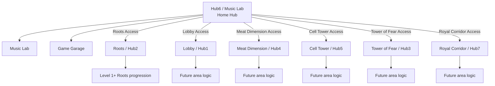
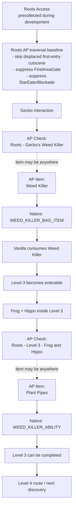
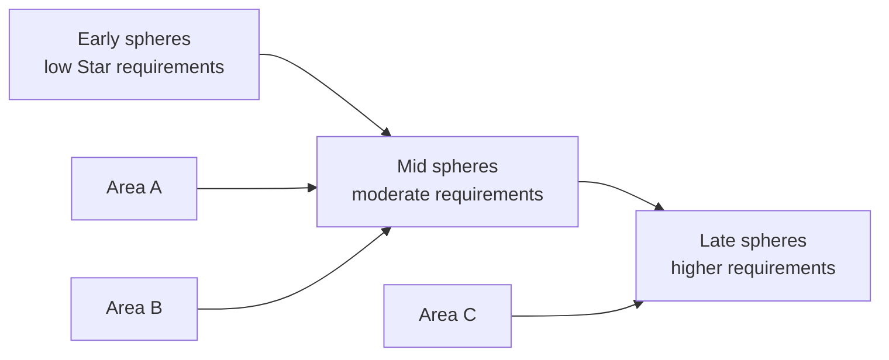
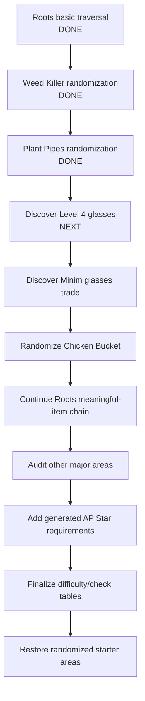

# Project Overview and Randomizer Design

This document is the living technical/design overview for the **Super Crazy Rhythm Castle Archipelago** project. It is intended to let players, testers, contributors, and future developers understand what the randomizer currently does, why it is structured this way, and what is planned next.

> **Status:** Work in progress. The implementation is being developed incrementally, with gameplay testing used to confirm native progression flags and source behavior before those systems are committed to Archipelago logic.

## 1. Project goals

The project integrates **Super Crazy Rhythm Castle** with the Archipelago multiworld randomizer using two cooperating components:

- **Client plugin (`client/`)** — a BepInEx / IL2CPP C# plugin running inside the game. It observes native progression, sends location checks, receives AP items, applies native item/ability state, and normalizes campaign-order blockers that would otherwise make randomized routing impossible.
- **APWorld (`apworld/`)** — defines items, locations, regions, rules, precollected items, and seed generation behavior for Archipelago.

The core design rule is:

```text
Do not replace meaningful game progression with generic unlocks when the real item/story interaction can be preserved.
```

A physical vanilla item source should become an AP **location/check**, while the useful item or ability becomes an AP **item**. When that AP item is received, the client grants the corresponding real native state. Vanilla consumption, trades, and unavoidable story consequences are preserved whenever practical.

---

## 2. High-level randomizer model



### Current starter policy

During the Roots implementation/audit phase, **Roots Access is always precollected** on a new seed. The other five Area Access items are randomized normally.

This is temporary development policy. Once all six areas are proven starter-safe, starter selection can be randomized again.

### Long-term level reachability rule

The intended final rule for a level is:

```text
Area reachable
+ AP Star requirement
+ meaningful randomized item prerequisites
+ unavoidable vanilla story state
```

Randomized Star requirements are intentionally being added **after** the meaningful item/story graph is understood, so Stars do not accidentally bypass important quest progression.

---

## 3. AP item catalog

This table lists the item names currently known to the APWorld. Permanent network IDs are tracked separately in [`IDS.md`](IDS.md).

### Active items

| Item | Classification / purpose | Current behavior |
| --- | --- | --- |
| **Stardust** | Filler | Fills unused item-pool slots. It intentionally has no native progression mapping. |
| **Roots Access** | Progression | Opens the Roots phone route from Hub6. Currently forced precollected. |
| **Lobby Access** | Progression | Opens the Lobby phone route from Hub6. |
| **Meat Dimension Access** | Progression | Opens the Meat Dimension phone route from Hub6. |
| **Cell Tower Access** | Progression | Opens the Cell Tower phone route from Hub6. |
| **Tower of Fear Access** | Progression | Opens the Tower of Fear phone route from Hub6. |
| **Royal Corridor Access** | Progression | Opens the Royal Corridor phone route from Hub6. |
| **Bloody Tears Cartridge** | Progression/useful | Required to use the Bloody Tears song in Game Garage. |
| **Gradius Remix Cartridge** | Progression/useful | Required to use the Gradius Remix song in Game Garage. |
| **Smooch Cartridge** | Progression/useful | Required to use the Smooch song in Game Garage. |
| **Superstar Cartridge** | Progression/useful | Required to use the Superstar song in Game Garage. |
| **Vampire Killer Cartridge** | Progression/useful | Required to use the Vampire Killer song in Game Garage. |
| **Wag the Dog Cartridge** | Progression/useful | Required to use the Wag the Dog song in Game Garage. |
| **Weed Killer** | Progression | Native consumable quest item from Gecko. AP delivery grants `WEED_KILLER_BAG_ITEM`; vanilla later consumes it to reveal/access Level 3. |
| **Plant Pipes** | Progression | Permanent usable ability obtained from Frog and Hippo in Level 3. AP delivery grants `WEED_KILLER_ABILITY`. Required to complete Level 3. |

### Historical item IDs retained for compatibility

| Item | Status |
| --- | --- |
| **Level 2 Access** | Historical. ID is preserved but this item is no longer generated by the Area Access design. |
| **Level 3 Access** | Historical. ID is preserved but this item is no longer generated by the Area Access design. |

### Planned meaningful items

These names are design targets, not yet committed AP items unless listed above:

| Planned item | Source / role | Status |
| --- | --- | --- |
| **Hip Glasses** | Picked up near the end of Level 4; `LEVEL_08_GLASSES_COLLECTED` is the source and `HIP_GLASSES_BAG_ITEM` is the held item consumed by the Bucket Minion. | Native mapping verified / not implemented. Reload and AP-history reconciliation remain implementation requirements. |
| **Chicken Bucket** | `ROOTS_HUB_BUCKET_MINION_SWAPPED_FOR_GLASSES` is the trade source; `CHICKEN_BUCKET_BAG_ITEM` is later consumed into `COMBO_BUCKET_ABILITY` during Lift Quest. | Native mapping verified / not implemented. The normal trade and use remain player-driven; Combo Bucket is the vanilla consequence. |
| Additional vanilla quest items / abilities | Converted individually when they materially gate traversal or completion. | Future work. |

---

## 4. Roots progression graph

Roots is the first area being fully modeled because it contains several examples of the randomizer's intended philosophy: physical source checks, consumable quest items, permanent abilities, partial-level checks, and campaign-order blockers.



### Gecko / Weed Killer

Vanilla sequence observed and preserved:

```text
ROOTS_HUB_PHONE_BOX_OPENED
→ ROOTS_HUB_GECKO_VANISHED
→ WEED_KILLER_BAG_ITEM = True
→ ROOTS_HUB_WEED_KILLER_COLLECTED = True
```

AP behavior:

- Gecko's native `WEED_KILLER_BAG_ITEM` grant is suppressed.
- `ROOTS_HUB_WEED_KILLER_COLLECTED` is retained as the native source/story marker.
- That marker sends **`Roots - Gecko's Weed Killer`**.
- Receiving **Weed Killer** from AP applies the real `WEED_KILLER_BAG_ITEM` state.
- Vanilla is then allowed to consume the Weed Killer normally to reveal Level 3.

### Frog + Hippo / Plant Pipes

Observed native mapping:

```text
WEED_KILLER_ABILITY = True
LEVEL_07_WK_ABILITY_EARNED = True
```

AP behavior:

- `WEED_KILLER_ABILITY` is suppressed at the vanilla Frog/Hippo source.
- `LEVEL_07_WK_ABILITY_EARNED` remains native and sends **`Roots - Level 3 - Frog and Hippo`**.
- Receiving **Plant Pipes** from AP grants the real `WEED_KILLER_ABILITY`.

### Intentional partial-level progression

Level 3 is deliberately split into **reachability** and **completion**:

```text
Reach Frog/Hippo:
    Roots Access
    + Weed Killer / Level 3 entrance state

Complete Level 3:
    everything above
    + Plant Pipes
```

Therefore a valid seed can require the player to:

1. Enter Level 3.
2. Reach Frog/Hippo and send their AP check.
3. Not have Plant Pipes yet.
4. Exit the level using the normal menu.
5. Continue elsewhere until Plant Pipes arrives.
6. Return and finish Level 3.

The APWorld must never require Plant Pipes to reach its own Frog/Hippo source check.

### First-entry Roots cutscene bypass

The AP start spawns the player in Hub6 rather than following the game's original intro path. When first entering Roots from this displaced route, the normal Roots arrival cutscene can run while the camera/player are elsewhere, which appears as an unexplained movement lock.

Immediately before a permitted first transition into Hub2, the client sets only:

```text
ROOTS_HUB_INTRO_WITNESSED = True
```

This skips that one-time presentation. It does not spoof Gecko, Star Eater, Weed Killer, Level 3, or other Roots quest state.

### Campaign-order traversal normalization

`Roots Access` currently suppresses two physical blockers that exist because vanilla assumes a fixed campaign order:

- `FirstAreaGate`
- `Root/GameRoom_Hub2_Logic/Objects/StarEaterBlockade/Blockade`

These are physical traversal normalizations only. The randomizer does not set the corresponding quest completion flags merely to make the player pass.

---

## 5. Area Access and Hub6 phone routing

Hub6 / Music Lab is the AP home hub. Music Lab and Game Garage remain available regardless of major-area ownership.

The six major Hub6 phones map as follows:

| AP area | Game destination / phone root |
| --- | --- |
| Roots | `GameRoom_Hub2` / `BoxDoor_Roots` |
| Lobby | `GameRoom_Hub1A` / Hub1B / `BoxDoor_Lobby` |
| Meat Dimension | `GameRoom_Hub4` / `BoxDoor_Meat` |
| Cell Tower | Hub5A/B / `BoxDoor_Prison` |
| Tower of Fear | `GameRoom_Hub3` / `BoxDoor_Madness` |
| Royal Corridor | `GameRoom_Hub7` / `BoxDoor_Royal` |

### Locked phone behavior

For an area the player does not own:

- the invisible phone interaction is disabled;
- its transition reactor is disabled;
- known cloth covers remain active;
- the transition request is safety-gated as a final defense.

For an AP-owned area:

- the phone becomes usable;
- its cloth cover is removed where applicable;
- late-game vanilla "visited/open" conditions local to that Hub6 phone can be bypassed without changing the underlying save flag.

This prevents the AP Area Access item from being defeated by campaign-order assumptions in the vanilla phone logic.

---

## 6. Game Garage system

Game Garage currently has **six randomized cartridge items** and **24 sticker checks**.

### Songs

- Bloody Tears
- Gradius Remix
- Smooch
- Superstar
- Vampire Killer
- Wag the Dog

### Sticker locations

Each song has four cumulative sticker tiers:

```text
Bronze
Silver
Gold
Platinum
```

Location format:

```text
Game Garage - {song} - {tier}
```

If a run earns a higher tier, all lower cumulative tiers are considered satisfied as appropriate.

### Cartridge source behavior

The six cartridges are AP items. Native cartridge grants outside Game Garage are suppressed, while the native **collected/source marker** is kept so the physical pickup can become an AP location.

Known source checks include:

- Music Lab reward chest source for **Gradius Remix**
- Music Lab reward chest source for **Bloody Tears**
- `Cartridge Pickup - Smooch`
- `Cartridge Pickup - Superstar`
- `Cartridge Pickup - Vampire Killer`
- `Cartridge Pickup - Wag the Dog`

Inside Game Garage, only AP-owned cartridges are released through the normal game insertion/use path.

APWorld Garage sticker reachability requires the corresponding cartridge item.

---

## 7. Music Lab cassette system

The client currently recognizes **30 cassette song variants**. Each cassette has four cumulative medal checks:

```text
Bronze
Silver
Gold
Platinum
```

Location format:

```text
Music Lab Cassette - {song} - {tier}
```

### Recognized cassette songs

1. The Little Things
2. No Plan B
3. Jolt City
4. Quieres Bailar
5. Quicksand
6. Gold
7. I Got Money
8. Hippo and Frog
9. On the Way
10. Badass
11. Heavy Metal
12. AOK
13. Rainbow Melodies
14. Sneaking
15. The Heist
16. Money
17. Lets Go
18. Bounce
19. Epical
20. Hollywood Trailer
21. False Data
22. Gotta Get Up
23. Fumblin Around
24. Party Non Stop
25. Keep On Hustlin
26. Another Day In Paradise
27. Flamenco
28. Ten-Four Good Buddy
29. Zen
30. Wiggle

The client evaluates the real result-time clean-medal tier and sends cumulative checks accordingly.

---

## 8. Music Lab reward chest system

Nine Hub6 Music Lab reward chests are tracked from their live native metadata. The client does not create fake startup chest components; it waits until Hub6 loads and reads the actual chest unlock requirement and native collection flag.

Music Lab Points currently remain the game's native medal-score currency, read through `CurrentPlayerSaveEnquiries.GetMedalScore()`. The nine reward chests are AP locations; Music Lab Points are not currently generated AP inventory items. Separate AP Music Lab Point inventory is approved future design, not implemented; its final item distribution remains provisional until the location count is validated.

| Point threshold | Native chest |
| ---: | --- |
| 5 | ManiacMemoryCardChest |
| 10 | GarageCartridgeChest_Gradius |
| 20 | CatBatteryChest |
| 32 | SongChest_QuickSand |
| 46 | GarageCartridgeChest_BloodyTears |
| 64 | SongChest_Flamenco |
| 89 | SongChest_TenFourGoodBuddy |
| 111 | SongChest_Zen |
| 140 | SongChest_Wiggle |

Already-collected rewards are reconciled idempotently against the save when Hub6 is available.

A developer-only Music Lab point override exists for testing reward thresholds without modifying saved medal totals.

---

## 9. Level completion checks

Level completion is observed through native result persistence. Current APWorld baseline includes:

- Level 1 - Completion
- Level 2 - Completion
- Level 3 - Completion

The current APWorld assigns these early completion locations to Roots while that area's progression graph is being built.

Completion logic will become more detailed as Star requirements and meaningful item prerequisites are introduced.

---

## 10. Difficulty and performance-check design

The approved future randomizer difficulty choices are:

- **Normal**
- **Hard**
- **Expert**
- **Perfection**

This is approved design, not current v0.15 generation behavior. It controls which performance-based checks a seed contains without changing the fundamental AP item graph:

| AP difficulty | Campaign levels | Music Lab and Game Garage |
| --- | --- | --- |
| Normal | Completion / 1-Star | Bronze |
| Hard | Completion / 1-Star + 2-Star | Bronze + Silver |
| Expert | Completion / 1-Star + 2-Star + 3-Star | Bronze + Silver + Gold |
| Perfection | Same campaign tiers as Expert | Bronze + Silver + Gold + Platinum |

A key current design rule is:

> **Normal difficulty does not create 2-star or 3-star performance checks.**

Higher difficulty modes expose progressively stricter performance checks. The table is approved; native mapping, generation, and gameplay validation are still required before it becomes stable generation behavior.

This is distinct from AP **Star requirements** used to open progression. Performance checks are locations earned for playing levels well; Star requirements are planned gate values that will be generated according to logical depth.

---

## 11. Approved future AP Star gating

Randomized Star gates are approved future design, not a current v0.15 feature. They should not create a simple linear campaign.

Design goals:

- requirements generally increase with logical depth/spheres;
- multiple areas should remain viable at the same time;
- a seed should not force one strict area-by-area route;
- meaningful vanilla/AP item prerequisites remain authoritative;
- Stars must not stand in for a real quest item such as Weed Killer or Plant Pipes;
- generated requirements must match the actual checks accessible under the selected difficulty/check settings.

Conceptually:



Generation implementation and validation are still required.

---

## 12. Secret Bunker system

The Secret Bunker remains a special progression path separate from normal area routing.

Current client behavior includes a final Hub8 Star Eater requirement override used for development/testing. The current test target is **50 Stars**.

The approved future design uses a meaningful **Bunker Keycard** as the Secret Bunker access item, rather than a generic Bunker Access item or Stars alone. It is not implemented in the APWorld; its native source/lifecycle mapping still requires validation, and the 50-Star Bunker Star Eater threshold remains provisional.

---

## 13. Development Cache locations

The APWorld retains ten `Development Cache` location IDs. These are historical/development allocations and should not be casually repurposed.

They are useful during implementation phases but are not intended to define the final player-facing progression structure.

See [`IDS.md`](IDS.md) before changing any network allocation.

---

## 14. Native progression philosophy

The client tries to distinguish three different concepts that vanilla games often collapse together:

### A. Physical source reached

Example:

```text
LEVEL_07_WK_ABILITY_EARNED
```

This means the player reached Frog/Hippo. It can remain true even if AP randomizes away the reward.

### B. Useful item / ability owned

Example:

```text
WEED_KILLER_ABILITY
```

This is the actual Plant Pipes ability and should only be granted when AP delivers Plant Pipes.

### C. Story consequence / consumption

Example:

```text
WEED_KILLER_BAG_ITEM = False
ROOTS_HUB_LEVEL_07_DOOR_REVEALED = True
```

Vanilla consumes Weed Killer and produces a world-state consequence. We preserve that behavior rather than faking the final door flag from AP.

This separation is central to preventing logic bugs and preserving the feel of the original game.

---

## 15. Client safety rules

The client follows several implementation rules developed through testing:

- Avoid continuous scene-wide `Resources.FindObjectsOfTypeAll` scans; they caused visible hitching in Roots.
- Prefer exact hierarchy paths or live native references once identified.
- Suppress only the specific native reward being randomized.
- Keep native collected/source markers where they represent physically reaching the source.
- Do not set broad campaign flags just to bypass a blockade when a physical object/condition can be normalized instead.
- AP item delivery should work regardless of whether the player has already visited the vanilla source.
- Reconciliation should be idempotent so reconnecting/reloading does not duplicate checks.

---

## 16. Current status matrix

| System | Status | Notes |
| --- | --- | --- |
| AP connection / item delivery | Implemented | Archipelago.MultiClient.Net client connection working. |
| Intro → Hub6 start | Implemented | Fresh game is redirected to AP home hub. |
| Area Access phone gating | Implemented foundation | Six area phones mapped; Roots currently forced starter. |
| Roots campaign-order baseline | Implemented | FirstAreaGate + StarEaterBlockade suppressed; first arrival cutscene bypassed. |
| Gecko / Weed Killer | Implemented and tested | Source check + randomized consumable delivery + native consumption work. |
| Frog/Hippo / Plant Pipes | Implemented and tested | Source check is reachable without Plant Pipes; ability is randomized. |
| Level 3 partial completion model | Implemented and tested | Player can menu-exit when Plant Pipes is elsewhere. |
| Level 4 Hip Glasses | Native mapping verified / not implemented | Source `LEVEL_08_GLASSES_COLLECTED`; held item `HIP_GLASSES_BAG_ITEM`. The source becomes an AP check and the native item grant will be suppressed. |
| Bucket Minion glasses trade | Native mapping verified / not implemented | Trade source `ROOTS_HUB_BUCKET_MINION_SWAPPED_FOR_GLASSES`; vanilla consumes Hip Glasses, grants Chicken Bucket, removes the blockade, and unlocks the King conversation. |
| Chicken Bucket | Native mapping verified / not implemented | Held item `CHICKEN_BUCKET_BAG_ITEM`; Lift Quest consumes it into `COMBO_BUCKET_ABILITY` and sets `LEVEL_09_COMBO_ABILITY_EARNED`. |
| Game Garage stickers | Implemented | 6 songs × 4 cumulative tiers. |
| Garage cartridges | Implemented | 6 AP items; source pickups/chests randomized. |
| Music Lab cassette medal checks | Implemented | 30 songs × 4 cumulative medal tiers; cassette items are not randomized in the current APWorld. |
| Cassette-item randomization | Design approved / not implemented | Requires source, inventory, insertion, and reconciliation mapping for every cassette. |
| Music Lab reward chests | Implemented | 9 thresholds, live metadata + reconciliation. |
| Secret Bunker | Design approved / not implemented | Bunker Keycard is the approved access item. A Star Eater test override exists; its 50-Star target remains provisional pending validation. |
| Difficulty options | Design approved / not implemented | Normal/Hard/Expert/Perfection cumulative table is approved; generation and native mapping remain unimplemented. |
| Random AP Star requirements | Design approved / not implemented | To be layered on after meaningful prerequisite mapping. |
| Other five areas | Implemented / needs more testing | Area Access phone routing exists, while starter safety and native progression audits remain required. |

---

## 17. Near-term roadmap



Completed 2026-08-21 evidence reconciliation:

```text
Level 4 sets HIP_GLASSES_BAG_ITEM + LEVEL_08_GLASSES_COLLECTED
→ Bucket Minion sets CHICKEN_BUCKET_BAG_ITEM and consumes HIP_GLASSES_BAG_ITEM
→ ROOTS_HUB_BUCKET_MINION_SWAPPED_FOR_GLASSES is the durable trade source
→ Lift Quest consumes CHICKEN_BUCKET_BAG_ITEM into COMBO_BUCKET_ABILITY
→ LEVEL_09_COMBO_ABILITY_EARNED records the conversion
```

The Area Access source/item/trade design and native mappings are now confirmed. The next step is an implementation design covering source suppression, AP delivery, native consumption precedence, reload, reconnect, and received-item-history reconciliation. Permanent IDs remain unallocated until that design is approved and implementation is ready.

---

## 18. Network ID policy

Archipelago IDs are permanent once used in a published/tested datapackage.

- Never reuse historical gaps.
- Never renumber an existing item/location to make the table prettier.
- Check [`IDS.md`](IDS.md) before adding anything.
- Update `IDS.md` in the same commit that introduces a new item/location.
- A datapackage-changing APWorld release requires generating a fresh test seed.

Current frontier at APWorld v0.15:

```text
Next safe item ID:     187256118
Next safe location ID: 187256180
```

---

## 19. Development and AI-use disclosure

This project is being developed using AI-generated code and documentation under human direction.

The project owner provides:

- gameplay knowledge;
- progression design and intended randomizer behavior;
- testing and validation;
- bug reports and native-state observations;
- decisions about what should or should not become randomized progression.

AI assistance is used heavily for:

- C# client implementation;
- APWorld Python implementation;
- diagnostics and log analysis;
- documentation;
- packaging and iteration.

A feature should not be considered validated simply because code was generated for it. Gameplay testing is the acceptance criterion.

---

## 20. Keeping this document current

**This file is a required living document.** Any change that materially affects player-facing randomizer behavior should update this overview in the same commit.

Update this file when any of the following changes:

- AP item names or meanings;
- AP location/check names;
- area routing;
- required native progression items/abilities;
- level reachability/completion logic;
- difficulty/check rules;
- Star-gating design;
- Garage/Music Lab/Secret Bunker behavior;
- current development status or roadmap.

For exact permanent network allocations, [`IDS.md`](IDS.md) remains the authoritative ID registry. For concise implementation-oriented logic notes, [`PROGRESSION.md`](PROGRESSION.md) remains the companion progression reference.
